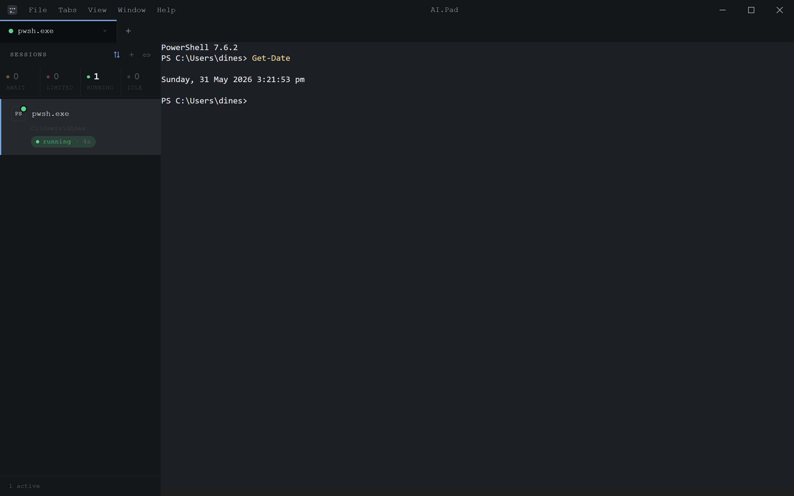
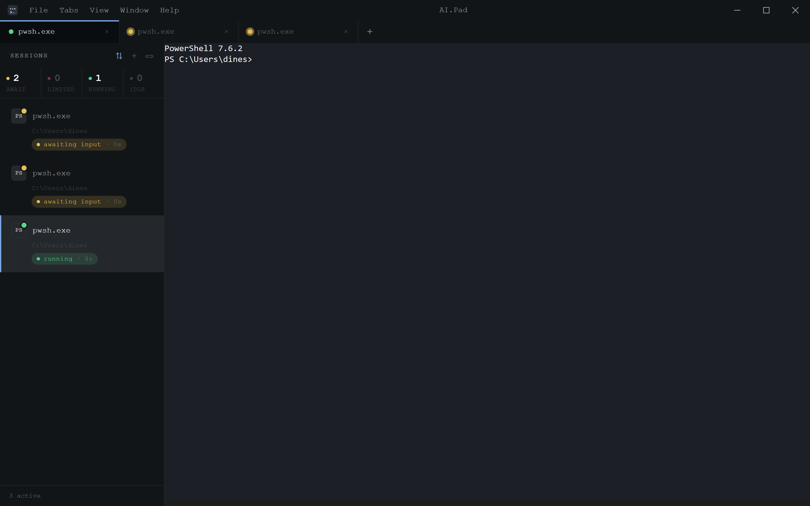
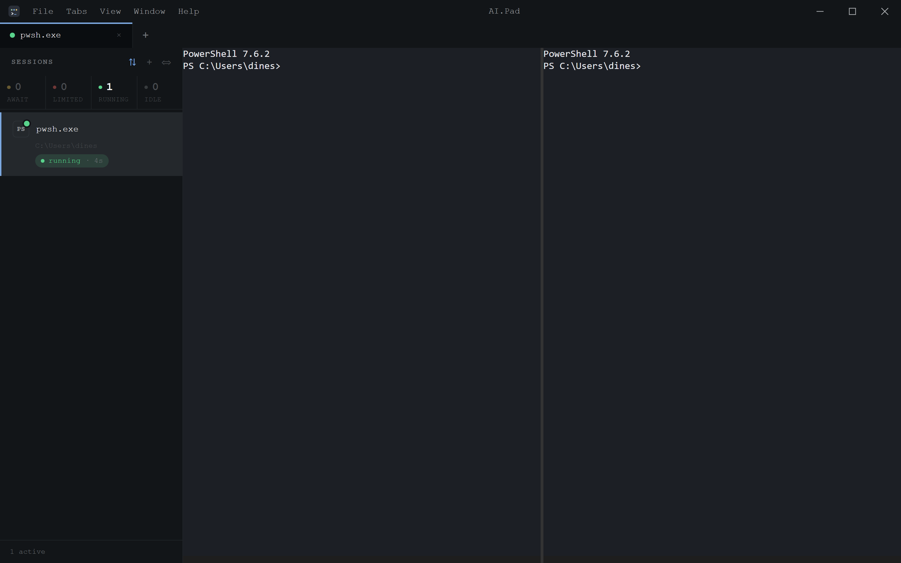
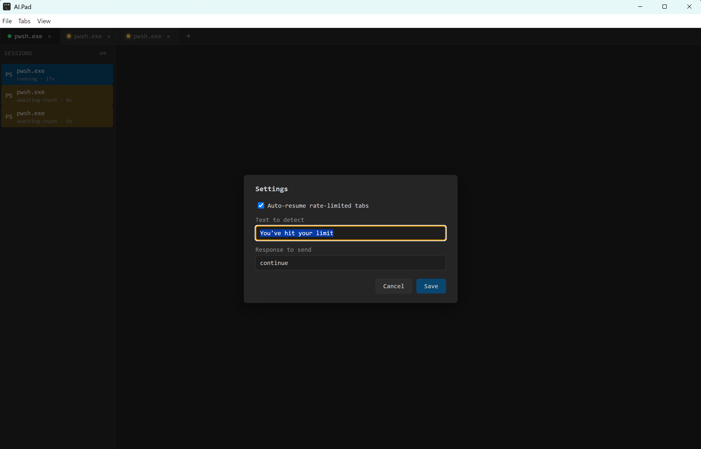

# AI.Pad

**Run many terminal sessions in parallel — and never miss the moment one of them needs you.**

AI.Pad is a cross-platform desktop terminal built for working with several AI coding
agents (Claude Code, Codex CLI, and friends) at once. Every project gets its own tab,
every tab runs a real shell, and the app watches all of them for you: when a background
session prints a prompt, hits a rate limit, or rings the bell, AI.Pad badges the tab and
fires a native OS notification — so you can keep your eyes on one session while the
others quietly wait their turn. It can even resume a rate-limited agent on its own.

> ### ⚠️ Important — build it yourself, for now
> AI.Pad is **not yet code-signed or notarised**, so there is no public, ready-to-run
> download. **Anyone who wants to use AI.Pad must build it on their own machine** from
> this repository, following the instructions below. Signed installers for Windows,
> macOS, and Linux will come once app signing is in place.

---

## Features

- 🗂️ **Tabbed sessions** — run many shells side by side; create, close, switch, and reorder tabs entirely from the keyboard.
- 🐚 **Pick your shell per tab** — PowerShell, `cmd`, `bash`, `zsh`, `wsl`, or any custom command, each with its own working directory.
- 🔔 **Attention awareness** — when a *background* session needs input, its tab badges with a yellow dot and the sidebar highlights it.
- 🖥️ **Native OS notifications** — get a desktop notification when a session needs you and the window is unfocused or you're on a different tab; click it to jump straight there.
- ⏳ **Rate-limit auto-resume** — detects when an AI agent says it's hit its usage limit, reads the reset time, and automatically resumes the session when the limit clears.
- ◧ **Split panes** — split any tab horizontally or vertically (VS Code-style) to watch two sessions in one view.
- 📋 **Live sidebar** — a collapsible rail listing every session with its shell, status (running / awaiting input / exited), and time-in-state.
- 💾 **Session persistence** — open tabs, shells, working directories, and layout are restored on the next launch.
- ⚙️ **Settings panel** — configure auto-resume detection and response text from an in-app dialog.
- ⌨️ **Keyboard-first** — every common action has a shortcut; see [Keyboard shortcuts](#keyboard-shortcuts).
- 🖧 **Cross-platform** — Windows, macOS, and Linux from a single codebase.
- 🛡️ **Crash isolation** — each session runs in its own process, so one misbehaving tab can't take the others down.

---

## Screenshots

**A single session — a normal, fast terminal.**



**Many tabs at once — background tabs badge yellow when they need you, and a native notification fires.**



**Split panes — watch two sessions in one tab.**



**Settings — configure rate-limit auto-resume.**



---

## Prerequisites

Install these before building, on every platform:

| Tool | Version | Notes |
|---|---|---|
| [Node.js](https://nodejs.org/) | 20 or newer | LTS recommended |
| [pnpm](https://pnpm.io/) | 9.x | Easiest via Corepack: `corepack enable` |
| [Git](https://git-scm.com/) | any recent | to clone the repository |

AI.Pad uses a native module (`node-pty`), so each OS also needs a working C/C++
build toolchain:

### Windows

- **PowerShell 7+** (`pwsh.exe`) on your `PATH` — this is AI.Pad's default shell.
- A **C++ build toolchain** for compiling the native PTY module. Either:
  - tick **"Tools for Native Modules"** when running the official Node.js installer, **or**
  - install **Visual Studio Build Tools** with the *Desktop development with C++* workload plus **Python 3** from the [Visual Studio Installer](https://visualstudio.microsoft.com/downloads/).

### macOS

- **Xcode Command Line Tools:**
  ```bash
  xcode-select --install
  ```

### Linux

- A C/C++ toolchain and Python 3. On Debian/Ubuntu:
  ```bash
  sudo apt-get install -y build-essential python3
  ```
  AppImage runtime libraries (`libfuse2`) may also be needed to *run* the packaged build:
  ```bash
  sudo apt-get install -y libfuse2
  ```

---

## Build & run

The steps below are the same on every OS unless noted.

### 1. Get the code

```bash
git clone https://github.com/ecogs-sys/AI.Pad.git
cd AI.Pad
corepack enable          # makes the pinned pnpm version available
```

### 2. Install dependencies

```bash
pnpm install
```

This fetches ~600 packages (Electron, `node-pty`, xterm, …) and compiles the native
PTY module for your platform — expect it to take a few minutes the first time.

### 3. Run in development

```bash
pnpm dev
```

A native window opens with one shell session inside it. This mode has hot-reload and
is the fastest way to try AI.Pad without packaging an installer.

### 4. Build an installer

To produce a distributable installer you build the app and then package it. Run the
**command for your platform** — `electron-builder` can only target the OS it runs on
without extra cross-compilation setup.

```bash
# Compile all packages and the Electron app first
pnpm build
```

**Windows** — produces an NSIS installer (`AI.Pad Setup x.y.z.exe`):
```powershell
pnpm --filter @aipad/desktop dist:win
```

**macOS** — produces a disk image (`AI.Pad-x.y.z.dmg`):
```bash
pnpm --filter @aipad/desktop dist:mac
```

**Linux** — produces an AppImage (`AI.Pad-x.y.z.AppImage`):
```bash
pnpm --filter @aipad/desktop dist:linux
```

The packaged output lands in `apps/desktop/release/<version>/`. Install or run it from
there.

> **A note on signing.** The macOS build config sets `mac.identity: null` so packaging
> works locally without an Apple Developer certificate. The resulting build is
> **unsigned** — macOS Gatekeeper and Windows SmartScreen will warn when you launch it,
> and you may need to allow it explicitly. This is expected: until AI.Pad ships signed
> releases, build and run it on your own machine, where an unsigned local build is fine.

### Build an installer (one command)

Clone the repo, then run the script for your OS from the repo root. It installs
dependencies (or skips them if already present), compiles the app, and produces a
platform installer in `apps/desktop/release/<version>/`.

**Windows (PowerShell):**
```powershell
.\scripts\build.ps1
```

**macOS / Linux:**
```bash
bash scripts/build.sh
```

> **Prerequisites:** Node.js ≥ 20 and pnpm (`corepack enable`) must be installed first.
> See the [Prerequisites](#prerequisites) section above for platform-specific build
> toolchain requirements (Visual Studio Build Tools on Windows, Xcode CLT on macOS).

### Project scripts

| Command | Effect |
|---|---|
| `pnpm dev` | Run the app in development mode with hot-reload |
| `pnpm build` | Compile all packages and the Electron app |
| `pnpm test` | Unit + integration tests (Vitest) |
| `pnpm test:e2e` | End-to-end tests against the packaged app (Playwright) |
| `pnpm typecheck` | TypeScript across all packages |
| `pnpm lint` | ESLint |
| `pnpm --filter @aipad/desktop dist:win\|dist:mac\|dist:linux` | Package an installer for that OS |

---

## Feature details

This section expands on the features listed above.

### Tabbed sessions

Each tab is an independent shell session backed by its own PTY. Open a new tab with
`Ctrl+T`, close the focused one with `Ctrl+W`, and move between them with
`Ctrl+Tab` / `Ctrl+Shift+Tab` or jump directly with `Ctrl+1`…`Ctrl+9`. Tabs can be
reordered by dragging. Because every session runs in its own process, a crash or hang
in one tab never affects the others.

### Pick your shell per tab

When you create a tab, the New Session dialog lets you choose the shell and the working
directory. On Windows the default is PowerShell 7 (`pwsh`), falling back to
`powershell.exe`; on macOS and Linux it's your login shell. You can also point a tab at
`cmd`, `wsl`, or any custom command — handy for launching a specific agent CLI directly.

### Attention awareness

AI.Pad watches each session's output for signs that it needs you — a terminal bell
(`BEL`), or going idle shortly after printing a recognised prompt. When a **background**
tab (one you're not currently looking at) raises a signal, its tab badges with a yellow
dot and its entry in the sidebar is highlighted and switches to an `awaiting-input`
status. The badge clears automatically as soon as you type into that session.

### Native OS notifications

When a session needs attention *and* the window is unfocused — or focused but on a
different tab — AI.Pad fires a native desktop notification naming the session. Clicking
the notification focuses the AI.Pad window and switches straight to that tab.
Notifications are coalesced (at most one per session in a short window) so a chatty
agent can't spam you.

### Rate-limit auto-resume

AI coding agents often pause with a message like *"You've hit your limit — resets at
9:30pm"*. AI.Pad scans session output for a configurable phrase, parses the reset time
(including an optional timezone), and — when that time arrives — automatically types a
response (by default, `continue`) into the tab to pick the work back up. The check is
done with a periodic sweep rather than a single long timer, so it stays reliable across
OS sleep and clock changes. Pending resumes are shown on a sidebar badge and can be
cancelled there. Configure the detection phrase and the response text in **Settings**.

### Split panes

Any tab can be split so two sessions share one view. `Ctrl+\` splits the focused pane
horizontally, `Ctrl+Shift+\` splits it vertically, and `Ctrl+Shift+W` closes the focused
pane. Each pane is a full, independent session — splitting is purely a layout choice.

### Live sidebar

The collapsible left rail (toggle with `Ctrl+B`) lists every session with its shell
icon, title, current status (`running`, `awaiting-input`, or `exited`), and how long
it's been in that state. Click an entry to focus its tab.

### Session persistence

Your open tabs, their shells, working directories, titles, and split layout are saved
and restored across restarts. PTYs respawn fresh on relaunch — the *layout* comes back,
but in-progress conversation state inside an agent is not preserved. The persisted state
lives in your platform's userData directory:

| OS | Path |
|---|---|
| Windows | `%APPDATA%\AI.Pad\sessions.json` |
| macOS | `~/Library/Application Support/AI.Pad/sessions.json` |
| Linux | `~/.config/AI.Pad/sessions.json` |

If that file is ever corrupted, AI.Pad backs it up and starts fresh — the app always
launches.

### Settings panel

Open **View → Settings…** (or `Ctrl+,`) to configure rate-limit auto-resume: turn it on
or off, set the **text to detect** that marks a rate-limit message, and set the
**response to send** when the limit resets. Settings persist across restarts.

### Keyboard shortcuts

| Shortcut | Action |
|---|---|
| `Ctrl+T` | New tab |
| `Ctrl+W` | Close focused tab |
| `Ctrl+Tab` / `Ctrl+Shift+Tab` | Next / previous tab |
| `Ctrl+1` … `Ctrl+9` | Jump to tab 1–9 |
| `Ctrl+B` | Toggle sidebar |
| `Ctrl+\` | Split focused pane horizontally |
| `Ctrl+Shift+\` | Split focused pane vertically |
| `Ctrl+Shift+W` | Close focused pane |
| `Ctrl+,` | Open Settings |

On macOS, use `Cmd` in place of `Ctrl`.

### Cross-platform & crash isolation

AI.Pad is built on Electron with one chrome renderer plus one isolated view per session.
The same codebase runs on Windows, macOS, and Linux, and the per-session process model
means a renderer crash in one tab is contained — the others (and their underlying
shells) keep running.
